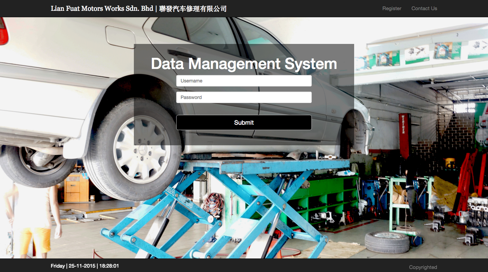
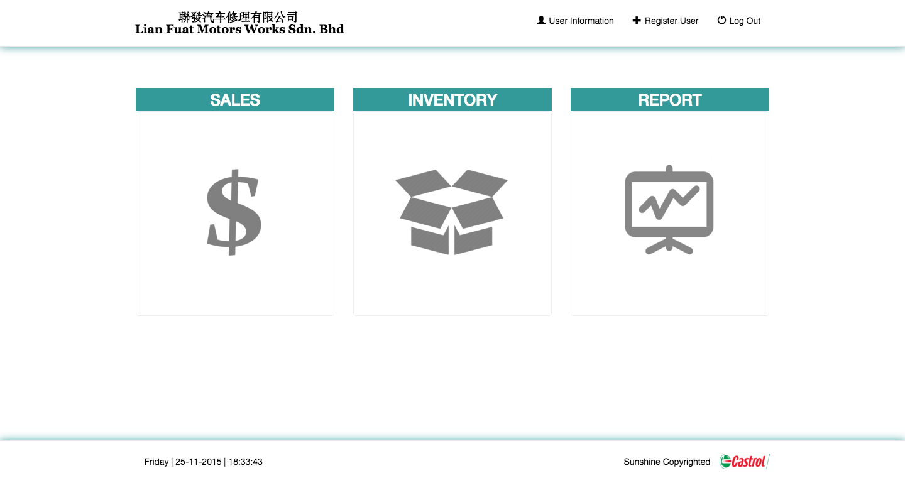
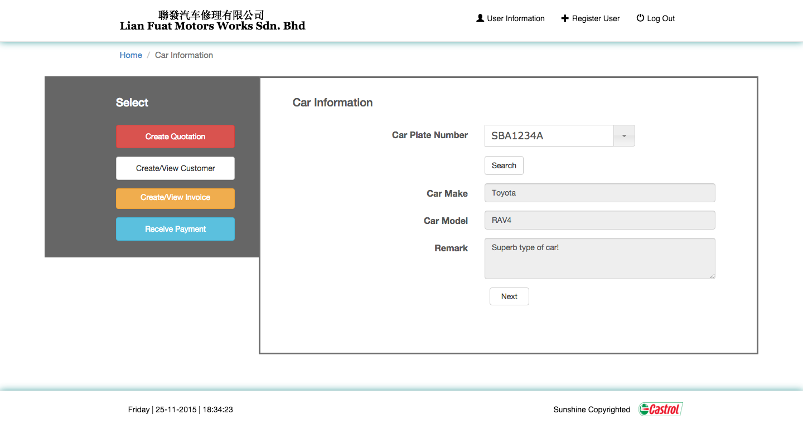
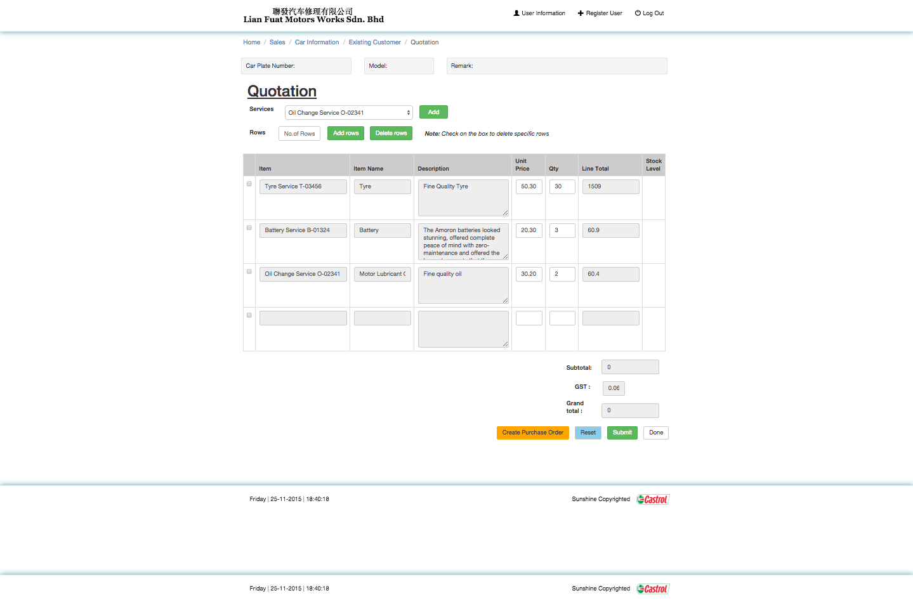
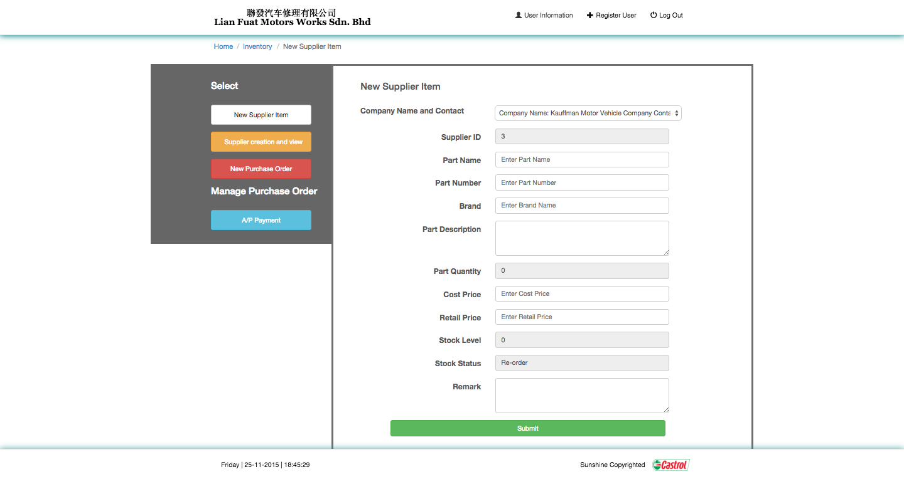
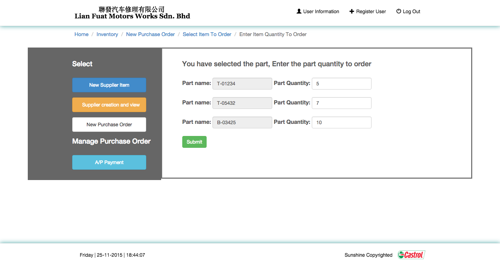
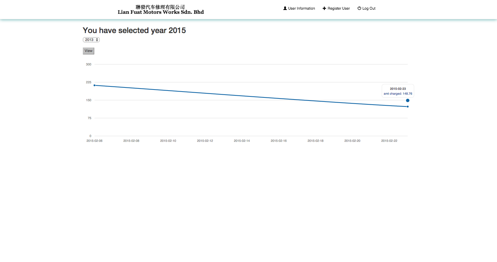
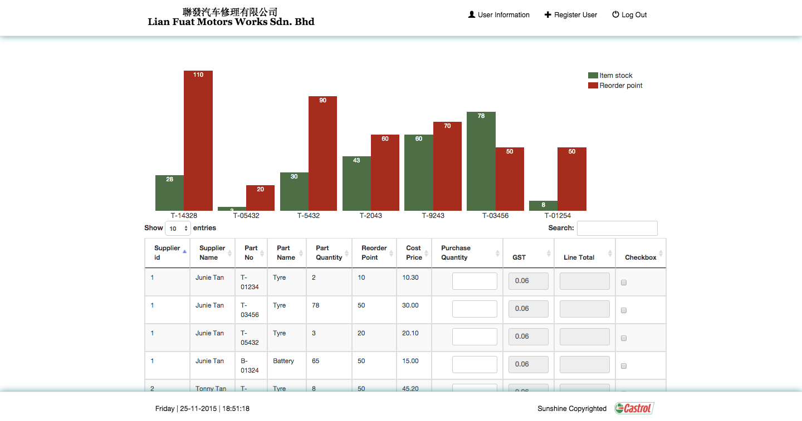

# Inventory Management System

## Description
This is a customised web-based inventory system that was built for our client, Lian Huat Motor Work, to ease their administrative work and increase accuracy for taking inventory stocks of vehicle parts.  

## Screenshots
Below are some screenshots for the main features of the inventory system 

#### Login Page

#### Main Menu
 
 
 ### Customer's Purchase Order
 #### Purchase Order for Customer
 

#### Search Customer's Vehicle

#### Create Customer's Quotation

### Supplier's Purchase Order
#### Purchase Order to Supplier
 
 
 #### Supplier's Item
 
 
 #### Supplier's Purchase Order Part Quantity
  
  
  ### Graphical Report
  #### Stock Report
   
   #### Inventory Stock Report
   
