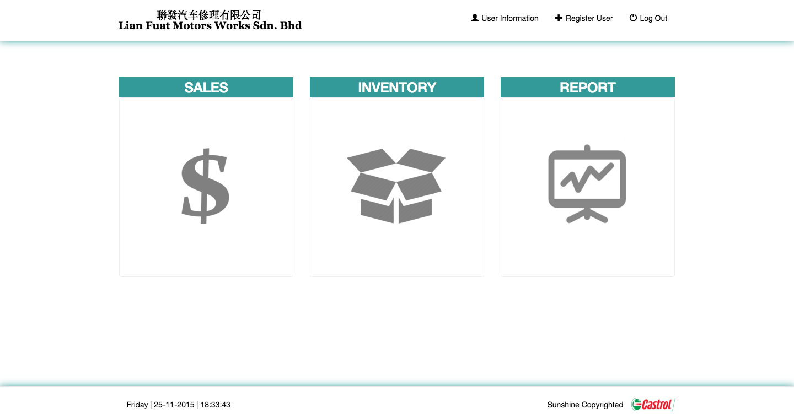
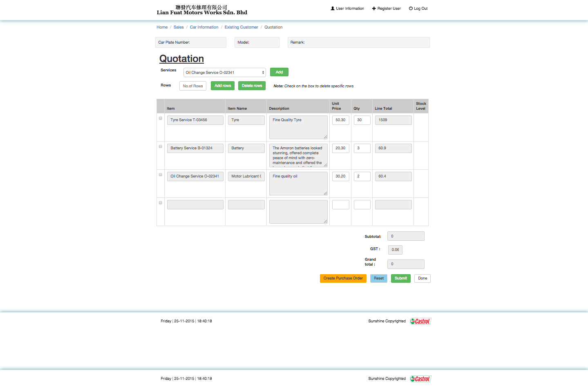
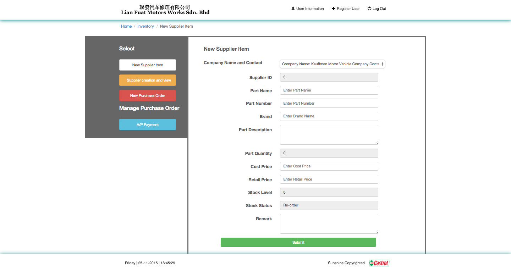
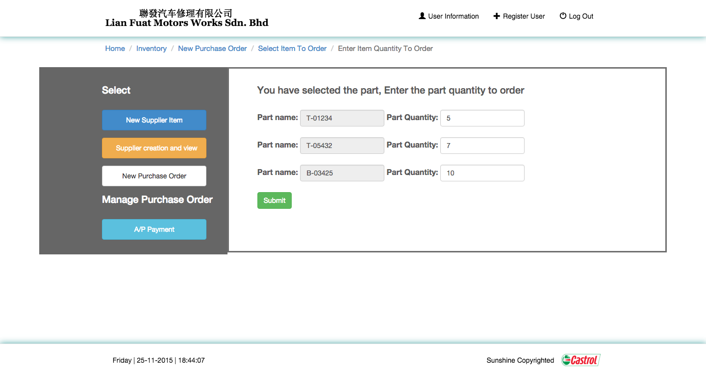

<h1>FYP Inventory Management System </h1>

<h2>Description</h2>

This is a customised web-based inventory system that was built for our client, Lian Huat Motor Work, to ease their administrative work and increase accuracy of taking inventory stocks for vehicle parts.  

<h2>Screen Shot</h2>
 <h4>Login Page</h4>
 ![Login Page] (IVM Pics/login_page.png)
  <h4>Main Menu</h4>
 

<h3>Customer Purchase Order</h3>
 <h4>Purchase Order for Customer</h4>
 
 <h4>Search Customer Vehicle</h4>
 
 <h4>Create Customer Quotation</h4>
 

<h3>Supplier Purchase Order</h3>
 <h4>Purchase Order to Supplier</h4>
 
 <h4>Supplier Item</h4>
 
 <h4>Supplier Purchase Order Part Quantity</h4>
 

<h3>Graph Report</h3>
 <h4>Stock Report</h4>
 
 <h4>Inventory Stock Report</h4>
 

