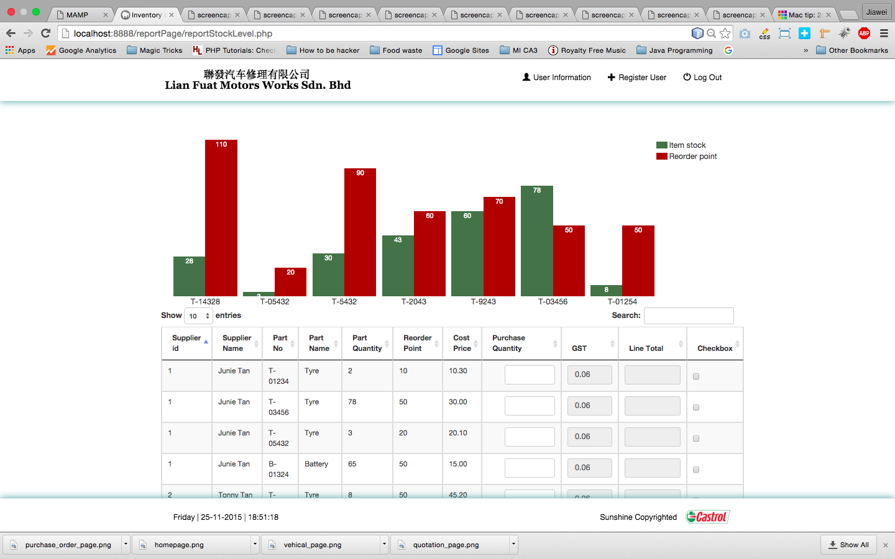

<h1>FYP Inventory Management System </h1>

<h2>Description</h2>

This is a small scale web-based inventory system that we have built to suit the needs of our client, Lian Fuat Motor Work, in their stock take of inventory, manage of purchase order and creation of sales  

<h2>Configuration</h2>
1.Install Easyphp Dev Server 14.1 VC11  
2. Create a new database in phpyMyAdmin  
2.Import database file 'final_inventory_management_system.sql' into the new database  
3.Import source codes into Easyphp project folder  
4.Configure authentication information as followed: 
  *  Set username:'InvUser01'  
  *  Set password: 'inventory123'  
  *  Check 'SELECT,INSERT,UPDATE,DELETE' in global priviledges under Users column  

<h2>Login Account</h2>
Username:admin  
Password:admin  

<h2>Screen Shot</h2>

<h3>Customer Purchase Order</h3>
 <h4>Customer Purchase Order</h4>
 
 <h4>Search Customer Vehicle</h4>
 
 <h4>Create Customer Quotation</h4>
 

<h3>Supplier Purchase Order</h3>
 <h4>Purchase Order to Supplier</h4>
 
 <h4>Supplier Item</h4>
 
 <h4>Supplier Purchase Order Part Quantity</h4>
 

<h3>Graph Report</h3>
 <h4>Stock Report</h4>
 
 <h4>Invetory Stock Report</h4>
 

